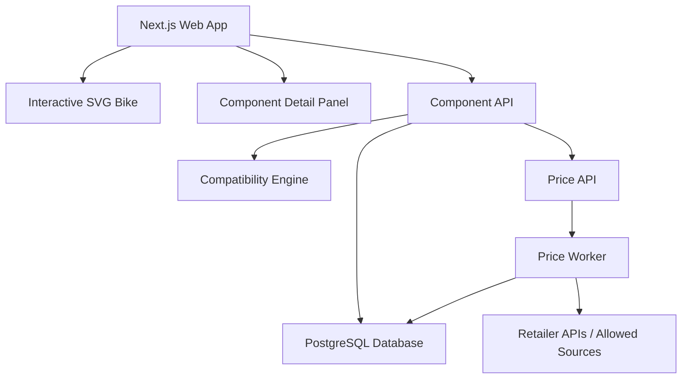

# Road Bike Component Configurator PRD

## 1. Project Introduction

This project is a web application that helps users understand, compare, and configure road bike components. Users can view a 2D interactive road bike diagram, click different bike parts, inspect component details, select alternative components from different brands, check compatibility, and view reasonable online price ranges.

The app is designed for cyclists who want to build, upgrade, or understand a road bike without needing deep mechanical knowledge. Instead of searching many websites and compatibility charts manually, users can visually explore the bike and receive clear compatibility feedback.

The first version should use a 2D interactive bike diagram rather than 3D. A 2D version is easier to build, faster to load, better for mobile, and more suitable for explaining component relationships. A 3D viewer can be added later as an advanced visual preview feature.

## 2. Product Goals

- Help users understand road bike components visually.
- Allow users to click bike parts and view detailed component information.
- Allow users to compare different brands and models.
- Check whether selected components are compatible.
- Search or collect online prices and show a reasonable price range.
- Save complete bike builds for later comparison.
- Provide a clean, beginner-friendly experience for users who are not bike mechanics.

## 3. Target Users

### Beginner Cyclists

Users who want to understand what each road bike component does and how components work together.

### Bike Upgrade Users

Users who already own a road bike and want to upgrade parts such as groupset, wheelset, cassette, crankset, or brakes.

### Second-Hand Bike Buyers

Users who want to check whether the parts on a used bike are valuable, compatible, and reasonably priced.

### Bike Builders

Users who want to plan a full custom road bike build before buying components.

## 4. MVP Scope

The MVP should focus on a 2D interactive bike diagram, component selection, basic compatibility checking, and price display.

### In Scope

- 2D side-view road bike diagram.
- Clickable bike components.
- Component detail panel.
- Groupset selection.
- Wheelset selection.
- Cassette selection.
- Crankset selection.
- Brake type selection.
- Compatibility warnings.
- Estimated price range.
- Save and load user bike builds.
- Search components by brand, model, and category.

### Out of Scope for MVP

- Full 3D bike rendering.
- Real-time global price comparison across all retailers.
- AI-based bike fitting.
- Automatic image recognition from bike photos.
- Checkout or e-commerce purchase flow.
- Marketplace seller system.
- Complete compatibility coverage for all historic components.

## 5. Core User Flow

1. User opens the web app.
2. User sees a 2D road bike diagram.
3. User clicks a component, for example the rear derailleur.
4. The right-side panel shows component details.
5. User selects a different brand or model.
6. The app updates the selected build.
7. The compatibility engine checks the full bike setup.
8. The app shows warnings or confirms compatibility.
9. User views estimated online price range.
10. User saves the bike build.

## 6. Functional Requirements

## 6.1 Interactive 2D Bike Diagram

The application must display a 2D side-view road bike diagram.

Clickable parts should include:

- Frame
- Fork
- Handlebar
- Shifters
- Stem
- Saddle
- Seatpost
- Crankset
- Bottom bracket
- Front derailleur
- Rear derailleur
- Cassette
- Chain
- Front wheel
- Rear wheel
- Tires
- Brake calipers
- Brake rotors, for disc brake bikes

When a user clicks a part:

- The part should be highlighted.
- The detail panel should update.
- Related parts should optionally be highlighted.

Example: clicking "groupset" should highlight shifters, derailleurs, crankset, cassette, chain, and brakes.

## 6.2 Component Detail Panel

The detail panel should show:

- Component name
- Brand
- Model
- Category
- Speed
- Brake type
- Weight, if available
- Material, if available
- Compatible standards
- Estimated price range
- Current compatibility status
- Notes or warnings

Example:

```text
Shimano 105 R7000 Rear Derailleur

Category: Rear Derailleur
Speed: 11-speed
Brake Type: Not applicable
Max Cassette: 34T
Compatible Chain: Shimano/SRAM 11-speed
Estimated Price: AUD $60 - $100
Status: Compatible
```

## 6.3 Component Selection

Users should be able to replace components with alternatives.

Filters should include:

- Brand
- Category
- Speed
- Brake type
- Price range
- Compatibility status
- Mechanical or electronic shifting

Supported initial brands:

- Shimano
- SRAM
- Campagnolo
- Microshift
- Sensah
- LTWOO

MVP should start with limited component groups:

- Shimano 105 R7000
- Shimano 105 R7100 / R7150 Di2
- Shimano Ultegra R8000 / R8100
- SRAM Rival AXS
- SRAM Force AXS

## 6.4 Compatibility Checker

The compatibility checker should validate selected components against rule-based constraints.

Important compatibility dimensions:

- Drivetrain speed
- Shifter and derailleur compatibility
- Cassette and rear derailleur max capacity
- Chain speed
- Crankset chainring setup
- Front derailleur support for 1x or 2x
- Brake type: rim, mechanical disc, hydraulic disc
- Frame brake mount
- Wheel axle type: quick release or thru axle
- Freehub body: Shimano HG, SRAM XDR, Campagnolo N3W
- Bottom bracket shell type
- Crank spindle type
- Rotor mount: 6-bolt or centerlock
- Tire clearance

Example rules:

```ts
if (shifter.speed !== rearDerailleur.speed) {
  return {
    status: "incompatible",
    message: "Shifter and rear derailleur speed do not match."
  }
}

if (cassette.freehub !== wheelset.freehub) {
  return {
    status: "incompatible",
    message: "Cassette does not fit the selected wheelset freehub."
  }
}

if (frame.brakeType !== brake.brakeType) {
  return {
    status: "incompatible",
    message: "Brake type does not match the selected frame."
  }
}
```

Compatibility status levels:

- Compatible
- Warning
- Incompatible
- Unknown

## 6.5 Price Search and Price Range

The application should show a reasonable online price range for each component.

MVP approach:

- Store manually collected price data first.
- Add scheduled price updates later.
- Show estimated price range instead of claiming exact live price.

Future approach:

- Integrate retailer APIs where possible.
- Use affiliate product APIs where allowed.
- Use scheduled crawlers only for websites that permit it.
- Cache price results in the database.
- Store source, currency, timestamp, and product URL.

Price data should include:

- Component ID
- Retailer name
- Product title
- Price
- Currency
- Product URL
- Last checked time
- Availability status

## 6.6 User Bike Builds

Users should be able to save configured builds.

Build data should include:

- Build name
- Selected frame
- Selected groupset
- Selected wheelset
- Selected cockpit components
- Selected saddle and seatpost
- Total estimated price
- Compatibility status
- Created time
- Updated time

Optional future features:

- Public build sharing
- Compare two builds
- Export build as PDF
- Add notes
- Mark owned components

## 7. Non-Functional Requirements

## 7.1 Performance

- Initial page load should be fast.
- 2D bike diagram should render instantly.
- Component filtering should feel responsive.
- Price search should be cached.
- Compatibility checks should run immediately after selection.

## 7.2 Mobile Support

- The app should work well on desktop and mobile.
- On desktop, use a bike diagram with a right-side detail panel.
- On mobile, use the bike diagram on top and component details below.
- Click targets should be large enough for touch input.

## 7.3 Reliability

- Compatibility rules should be traceable and easy to update.
- Price data should show last updated time.
- Unknown compatibility should be displayed honestly instead of guessed.

## 7.4 Maintainability

- Component data should be stored in structured tables.
- Compatibility rules should be separated from UI logic.
- Price collection should be separated from the main API.
- The frontend should not hardcode compatibility rules.

## 8. Recommended Tech Stack

## 8.1 Frontend

- Next.js
- TypeScript
- Tailwind CSS
- shadcn/ui
- Zustand
- SVG for the 2D bike diagram
- TanStack Query for API data fetching

Reason:

Next.js and TypeScript provide a strong foundation for a scalable web app. SVG is ideal for clickable 2D bike parts because each part can be represented as a separate interactive shape.

## 8.2 Backend

Recommended options:

- Hono
- Fastify
- NestJS

Best recommendation for this project:

- Hono if you want a lightweight TypeScript API.
- NestJS if you want a more enterprise-style modular backend.

For your background, Hono or NestJS would both be reasonable. If you want fast development and simple deployment, use Hono.

## 8.3 Database

- PostgreSQL
- Drizzle ORM

Reason:

Bike component data is structured and relational. PostgreSQL is suitable for component tables, compatibility rules, saved builds, price records, and user accounts.

## 8.4 Search

Options:

- PostgreSQL full-text search for MVP.
- Meilisearch or Typesense for better search later.

MVP recommendation:

- Start with PostgreSQL search.
- Add Meilisearch when the component database becomes larger.

## 8.5 Price Worker

- Node.js worker or Python worker
- BullMQ
- Redis
- Scheduled cron jobs

Responsibilities:

- Fetch price data.
- Normalize product titles.
- Match retailer products to internal component records.
- Store price history.
- Mark outdated prices.

## 8.6 Authentication

MVP options:

- Better Auth
- Auth.js
- Supabase Auth

Recommendation:

Use Better Auth or Auth.js if you want to keep the backend fully controlled by your own app.

## 8.7 Deployment

Suggested deployment:

- Frontend: Vercel
- Backend: VPS, Fly.io, Railway, or AWS
- Database: Supabase Postgres, Neon, or self-hosted PostgreSQL
- Redis: Upstash Redis or self-hosted Redis

## 9. Suggested System Architecture



## 10. Database Design Draft

## 10.1 components

Stores all bike components.

```ts
type Component = {
  id: string
  brand: string
  model: string
  category: string
  speed?: number
  brakeType?: "rim" | "mechanical_disc" | "hydraulic_disc"
  shiftingType?: "mechanical" | "electronic"
  freehub?: "shimano_hg" | "sram_xdr" | "campagnolo_n3w"
  axleType?: "quick_release" | "thru_axle"
  bottomBracketStandard?: string
  weightGram?: number
  description?: string
}
```

## 10.2 compatibility_rules

Stores compatibility rules.

```ts
type CompatibilityRule = {
  id: string
  sourceCategory: string
  targetCategory: string
  ruleType: string
  condition: Record<string, unknown>
  severity: "compatible" | "warning" | "incompatible" | "unknown"
  message: string
}
```

## 10.3 price_records

Stores price data.

```ts
type PriceRecord = {
  id: string
  componentId: string
  retailerName: string
  productTitle: string
  price: number
  currency: string
  url: string
  availability: "in_stock" | "out_of_stock" | "unknown"
  checkedAt: string
}
```

## 10.4 bike_builds

Stores user bike builds.

```ts
type BikeBuild = {
  id: string
  userId: string
  name: string
  selectedComponents: Record<string, string>
  estimatedTotalPrice: number
  compatibilityStatus: "compatible" | "warning" | "incompatible" | "unknown"
  createdAt: string
  updatedAt: string
}
```

## 11. UI Structure

## 11.1 Main Page

Desktop layout:

- Top navigation
- Left/main area: interactive bike diagram
- Right panel: selected component details
- Bottom or side section: compatibility summary

Mobile layout:

- Top navigation
- Bike diagram
- Component tabs
- Detail panel
- Compatibility summary

## 11.2 Component Panel

The panel should include:

- Selected component information
- Brand/model selector
- Compatibility status
- Price range
- Related components
- Warning messages

## 11.3 Build Summary

The build summary should include:

- Total estimated price
- Number of compatible components
- Number of warnings
- Number of incompatible selections
- Save build button

## 12. Example Compatibility Messages

Compatible:

```text
This cassette is compatible with the selected rear derailleur and wheelset.
```

Warning:

```text
This cassette may work, but it is close to the rear derailleur's maximum capacity.
```

Incompatible:

```text
This SRAM XDR cassette cannot be installed on a Shimano HG freehub body.
```

Unknown:

```text
Compatibility is unknown. Please check the manufacturer's technical document before buying.
```

## 13. Development Roadmap

## Phase 1: MVP

- Create Next.js app.
- Build SVG road bike diagram.
- Add clickable components.
- Add component detail panel.
- Add local component data.
- Add basic compatibility rules.
- Add saved builds.

## Phase 2: Backend and Database

- Add Hono or NestJS backend.
- Add PostgreSQL database.
- Add Drizzle ORM schema.
- Move component data to database.
- Add API endpoints.
- Add user authentication.

## Phase 3: Price System

- Add price records table.
- Add manual price input.
- Add scheduled price update worker.
- Add retailer source tracking.
- Add price history.

## Phase 4: Better Compatibility Engine

- Add official-source-based rule management.
- Add rule versioning.
- Add confidence level.
- Add admin UI for managing rules.

## Phase 5: Advanced Visual Features

- Add high-quality illustrated bike diagrams.
- Add different bike types: climbing bike, aero bike, endurance bike, gravel bike.
- Add optional 3D viewer using Three.js and React Three Fiber.

## 14. API Endpoint Draft

```text
GET /components
GET /components/:id
GET /components?category=groupset&brand=Shimano

POST /compatibility/check
POST /builds
GET /builds
GET /builds/:id
PATCH /builds/:id
DELETE /builds/:id

GET /components/:id/prices
POST /admin/prices/sync
```

## 15. MVP Success Criteria

The MVP is successful if:

- User can visually click at least 10 road bike parts.
- User can select components from at least 3 brands.
- App can detect basic drivetrain, brake, and wheel compatibility issues.
- App can show estimated price range for selected components.
- User can save and reopen a bike build.
- App works well on desktop and mobile.

## 16. Future 3D Version

After the 2D MVP is stable, a 3D mode can be added.

Suggested 3D stack:

- Three.js
- React Three Fiber
- Drei
- GLB/GLTF models
- Blender for model preparation

3D mode should be optional because it increases asset complexity and frontend performance requirements.

The best product direction is:

```text
2D mode = serious comparison and compatibility checking
3D mode = visual preview and premium experience
```

